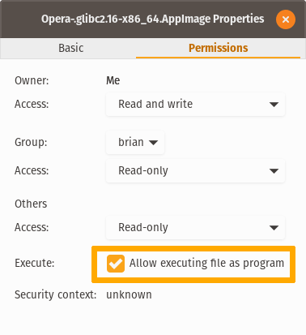

# opera-AppImage 
An AppImage build of Opera web browser.Download it, make it executable, and run it.
Note: This is only for 64-bit Linux system.

## Download
Go to [release](https://github.com/tyu1996/opera-AppImage/releases) page to download the latest AppImage build.

## How to use it
In terminal

> chmod +x ./*.AppImage

In GUI

